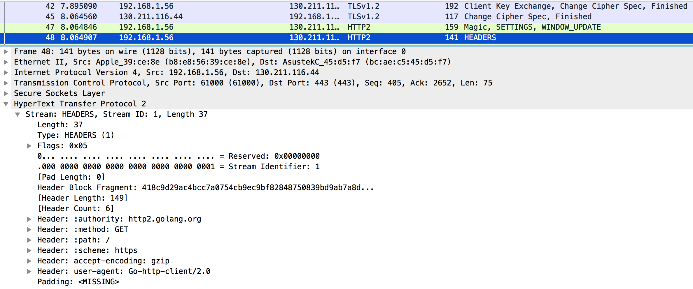

# Go crypto/tls key log example

With the to crypto/tls KeyLogWriter we can dump
TLS secrets in a format Wireshark can import. This makes
debugging TLS application issues much easier!

This example is now on Go master branch (for 1.8). It was initially
added in commit
[golang/go#320bd56](https://github.com/golang/go/commit/320bd562cbb24a01beb02706c42d06a290160645).

[golang/go #13057 crypto/tls: support NSS-formatted key log file](https://github.com/golang/go/issues/13057)

## Capturing and decoding TLS client traffic

With go development version or 1.8:

```bash
$ go get github.com/joneskoo/http2-keylog/h2keylog-client
$ h2keylog-client https://http2.golang.org/
2016/07/12 23:45:47 &{200 OK 200 HTTP/1.1 1 1 map[Date:[Tue, 12 Jul 2016 20:45:47 GMT] Content-Length:[682] Content-Type:[text/html; charset=utf-8]] 0xc820322080 682 [] false map[] 0xc8200c8000 0xc820244370}
```

You will want to run a packet capture, e.g. with Wireshark when
you call h2keylog-client. h2keylog-client will write a text file that
Wireshark can use to decrypt TLS traffic from the client.

```bash
# SSL/TLS secrets log file, generated by go
CLIENT_RANDOM b45c940d802822fd04c85a38b03b7227168457fbadb8be57a0f9cd05c4a0d2d3 6cbdd6f6bcdc5c3d7df7f0074b481eec649002ec64e2cfd91255e346aab617e72a1da2668176216e1d03f70505a335eb
```



## Server dump

Generate self signed server certificates:
```bash
$ (eval `go tool dist env`; go run $GOROOT/src/crypto/tls/generate_cert.go -host localhost)
2016/07/10 09:51:45 written cert.pem
2016/07/10 09:51:45 written key.pem
```

Run the server

```bash
$ go get github.com/joneskoo/http2-keylog/h2keylog-server
$ h2keylog-server
2016/07/12 23:29:07 Listening at https://[::1]:10443/
2016/07/12 23:29:07 Leaking TLS keys to ssl-keylog.txt
```

Meanwhile in another terminal, and while Wireshark capture is active:

```bash
$ curl -k 'https://localhost:10443/'
This is an example server.
```

Now the test server dumps client random and TLS master secret to a file

```bash
# SSL/TLS secrets log file, generated by go
CLIENT_RANDOM 5781f0898847c3eeea2f5b51b531d9b14f76bc1fd23af2e3896b7871d022e1ad c4dec1b90c263251ae38be20b54e2e7f861c4953042f4fd8a14bcc8c60a86691eb6bb6073e45258e7bfbade1e984987a
```

Boom, TLS decrypted in Wireshark!


