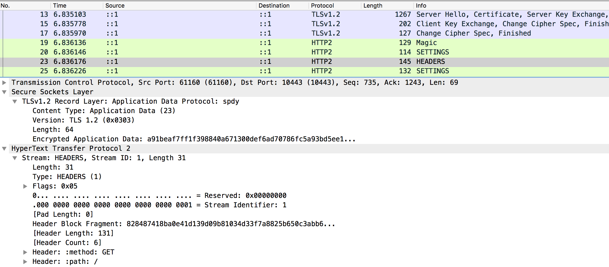

# Debugging TLS using Go crypto/tls key log

With the crypto/tls KeyLogWriter we can dump
TLS secrets in a format Wireshark can read to decrypt
TLS sessions. This allows debugging on-the-wire data
in applications, including perfect forward secrecy and
without access to server private key.

The key log must be enabled in application being debugged,
normally requiring a change in the source code. Both client
and server can be modified to log the secrets.

The required KeyLogWriter feature was introduced in commit
[golang/go#320bd56](https://github.com/golang/go/commit/320bd562cbb24a01beb02706c42d06a290160645)
and will be available in Go 1.8 when it is released.

[golang/go #13057 crypto/tls: support NSS-formatted key log file](https://github.com/golang/go/issues/13057)

## Capturing and decoding TLS client traffic

With go development version or 1.8, logging the TLS master secrets
for use with Wireshark is easy. Just set KeyLogWriter in tls.Config
to a writer (e.g. an open file).

See [h2keylog-client source code](https://github.com/joneskoo/http2-keylog/blob/master/h2keylog-client/client.go#L41-L50).

```bash
$ go get github.com/joneskoo/http2-keylog/h2keylog-client
$ h2keylog-client https://http2.golang.org/
2016/09/10 23:26:40 Leaking TLS keys to ssl-keylog.txt
HTTP/2.0 200 OK
Content-Length: 1708
Content-Type: text/html; charset=utf-8
Date: Sat, 10 Sep 2016 20:26:41 GMT

<html>
…
```

You need to start a packet capture, e.g. with Wireshark, before
you run h2keylog-client. h2keylog-client will write a text file that
Wireshark can use to decrypt TLS traffic from the client.

**ssl-keylog.txt:**

```bash
# SSL/TLS secrets log file, generated by go
CLIENT_RANDOM b45c940d802822fd04c85a38b03b7227168457fbadb8be57a0f9cd05c4a0d2d3 6cbdd6f6bcdc5c3d7df7f0074b481eec649002ec64e2cfd91255e346aab617e72a1da2668176216e1d03f70505a335eb
```

You can now use the file as (Pre)-Master-Secret in SSL preferences
in Wireshark to decode the traffic.


## Capturing and decoding TLS server traffic

Run the server

```bash
$ go get github.com/joneskoo/http2-keylog/h2keylog-server
$ h2keylog-server
2016/07/12 23:29:07 Listening at https://[::1]:10443/
2016/07/12 23:29:07 Leaking TLS keys to ssl-keylog.txt
```

You need to have TLS certificates to run the test server. You can
generate the required files with:

```
$ (eval `go tool dist env`; go run $GOROOT/src/crypto/tls/generate_cert.go -host localhost)
2016/07/10 09:51:45 written cert.pem
2016/07/10 09:51:45 written key.pem
```


Meanwhile in another terminal, and while Wireshark capture is active:

```
$ curl -k --http2 -6 'https://localhost:10443/'
This is an example server.
```

You can now use the file as (Pre)-Master-Secret in SSL preferences
in Wireshark to decode the traffic.


